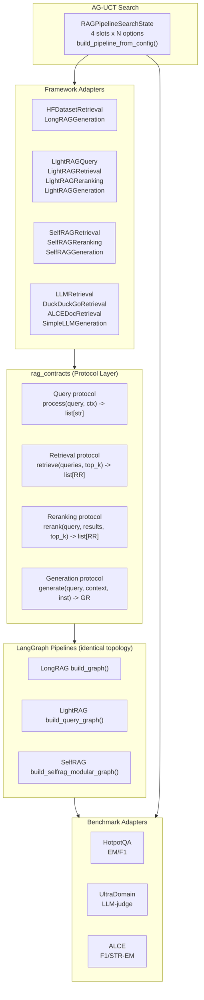
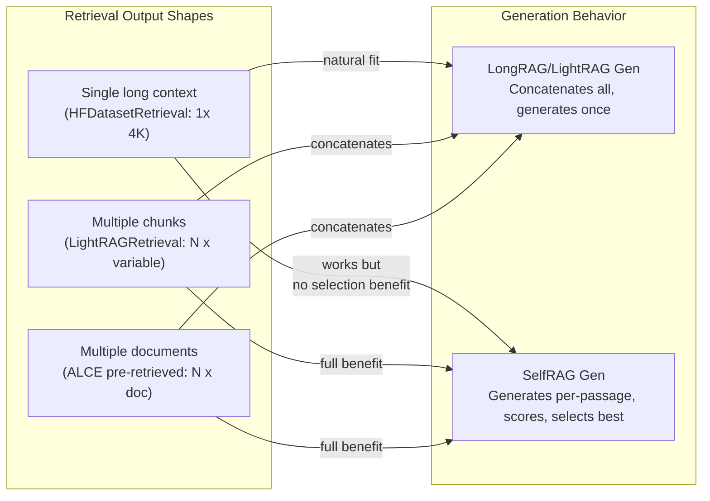

# OminiRAG -- Modular RAG Component Standardization

OminiRAG defines a **canonical 6-stage RAG pipeline** where every stage is a
replaceable component. Three real-world RAG systems -- **LongRAG** (extractive
QA), **LightRAG** (knowledge-graph-augmented retrieval), and **Self-RAG**
(LLM-based retrieval with evidence scoring) -- are refactored so that their
internal components can be freely swapped through a shared contract layer.

```text
Chunking -> Embedding -> Query -> Retrieval -> Reranking -> Generation
```

Components from any framework can be injected into any pipeline via dependency
injection. All three pipelines share an **identical 4-node LangGraph topology**:

```text
query_processing -> retrieval -> reranking -> generation -> END
```

An **AG-UCT search engine** explores the 4-slot configuration space across
3 benchmark datasets to find optimal component combinations.

---

## Overall Architecture




### Data Types (`rag_contracts/types.py`)


| Type               | Fields                                               |
| ------------------ | ---------------------------------------------------- |
| `RetrievalResult`  | `source_id`, `content`, `score`, `title`, `metadata` |
| `GenerationResult` | `output`, `citations`, `metadata`                    |
| `QueryContext`     | `topic`, `history`, `metadata`                       |
| `Document`         | `doc_id`, `content`, `metadata`                      |
| `Chunk`            | `chunk_id`, `doc_id`, `content`, `metadata`          |


---

## Core Idea

Each stage is a Python `Protocol` (structural interface). Any class that
implements the right method signature is automatically compatible -- no
inheritance required. Three projects with completely different architectures can
exchange components at any stage.

```text
                    rag_contracts (shared protocols)
                   +------------------------------+
                   |  Chunking   .chunk()          |
                   |  Embedding  .embed()          |
                   |  Query      .process()        |
                   |  Retrieval  .retrieve()       |
                   |  Reranking  .rerank()         |
                   |  Generation .generate()       |
                   +--+---------------+--------+---+
                      |               |        |
          +-----------v--+   +-------v------+ +v-----------+
          |   LongRAG    |   |   LightRAG   | |  Self-RAG  |
          |  (adapters)  |   |  (adapters)  | | (adapters) |
          +--------------+   +--------------+ +------------+
```

---

## Framework x Benchmark Matrix

### Benchmarks

**HotpotQA**: Multi-hop QA over Wikipedia. Input is a question; context is pre-grouped 4K-token chunks. Evaluation: EM, F1. Challenge: connecting facts across multiple passages.

**UltraDomain**: Domain-specific QA (agriculture, CS, legal, mix). Input is a domain text corpus in JSONL format. Evaluation: LLM-as-judge (Comprehensiveness, Diversity, Empowerment). Challenge: deep domain knowledge, entity relationships.

**ALCE**: Per-document segmented QA (ASQA, QAMPARI, ELI5). Input is a question plus N pre-retrieved documents. Evaluation: F1, STR-EM, citation recall/precision. Key characteristic: documents are already segmented -- each doc is a separate passage, making it a natural fit for Self-RAG's per-passage scoring.

### How Each Framework Handles Each Benchmark


| Benchmark       | LongRAG                                                      | LightRAG                                                                                 | Self-RAG                                                                                                                    | Key Challenge             |
| --------------- | ------------------------------------------------------------ | ---------------------------------------------------------------------------------------- | --------------------------------------------------------------------------------------------------------------------------- | ------------------------- |
| **HotpotQA**    | Native (HFDataset -> reader). Single 4K context per query.   | KG index over Wikipedia. Multi-hop KG expansion is a natural fit. Needs pre-built index. | Needs retrieval returning MULTIPLE passages for selection advantage. With single HFDataset passage, degrades to simple gen. | Multi-hop fact connection |
| **UltraDomain** | Same chunking approach applicable. Not natively implemented. | Native (hybrid vector+KG). Full pipeline designed for this.                              | Same as HotpotQA -- needs multi-chunk retrieval. Pair with LightRAGRetrieval.                                               | Deep domain knowledge     |
| **ALCE**        | Can concatenate pre-retrieved docs and extract answer.       | KG index over ALCE source corpus (bypasses pre-retrieved docs).                          | Natural fit -- ALCE provides N segmented docs, SelfRAG scores each independently.                                           | Per-document evaluation   |


**Critical insight**: SelfRAGGeneration provides maximum value when retrieval returns MULTIPLE passages (for per-passage scoring+selection). When only 1 passage exists (HFDatasetRetrieval), it degrades to simple generation.




---

## All Possible Component Combinations

### Available Components by Slot


| Slot           | Component             | Source                               | Notes                                                                                                        |
| -------------- | --------------------- | ------------------------------------ | ------------------------------------------------------------------------------------------------------------ |
| **Query**      | `IdentityQuery`       | `rag_contracts`                      | Passthrough -- returns `[query]`                                                                             |
|                | `LightRAGQuery`       | `lightrag_langgraph/adapters.py`     | LLM keyword extraction -> `[query, kw1, kw2, ...]`                                                           |
| **Retrieval**  | `HFDatasetRetrieval`  | `longRAG_example/.../adapters.py`    | Pre-joined 4K context from HF dataset                                                                        |
|                | `LightRAGRetrieval`   | `lightrag_langgraph/adapters.py`     | Hybrid vector+KG (4 stores). Requires pre-built KG index.                                                    |
|                | `SelfRAGRetrieval`    | `selfrag/adapters.py`                | Contriever cosine search. Requires Contriever model + VectorStore + DocStore.                                |
|                | `LLMRetrieval`        | `rag_contracts/common_components.py` | LLM-generated background context. No corpus needed.                                                          |
|                | `DuckDuckGoRetrieval` | `rag_contracts/common_components.py` | Web search via DuckDuckGo. No corpus needed.                                                                 |
|                | `FallbackRetrieval`   | `rag_contracts/common_components.py` | Chains primary + fallback retrieval.                                                                         |
|                | `ALCEDocRetrieval`    | `rag_contracts/common_components.py` | Wraps ALCE pre-retrieved docs as Retrieval.                                                                  |
| **Reranking**  | `IdentityReranking`   | `rag_contracts`                      | Passthrough -- returns results unchanged                                                                     |
|                | `LightRAGReranking`   | `lightrag_langgraph/adapters.py`     | LLM context compression into focused evidence brief.                                                         |
|                | `SelfRAGReranking`    | `selfrag/adapters.py`                | Per-passage generate+score (ISREL/ISSUP/ISUSE). Caches predictions for downstream generation.                |
| **Generation** | `IdentityGeneration`  | `rag_contracts`                      | Joins content, returns concatenated text                                                                     |
|                | `LongRAGGeneration`   | `longRAG_example/.../adapters.py`    | LLM reader (predict_nq/predict_hotpotqa). Short answer extraction.                                           |
|                | `LightRAGGeneration`  | `lightrag_langgraph/adapters.py`     | LLM answer with structured context + optional compressed notes.                                              |
|                | `SelfRAGGeneration`   | `selfrag/adapters.py`                | Per-passage generate+score+select. Returns best-scored answer. Reuses SelfRAGReranking cache when available. |
|                | `SimpleLLMGeneration` | `rag_contracts/common_components.py` | Generic LLM-based answer extraction.                                                                         |


### Combination Space

- Query: 2 options (Identity, LightRAG)
- Retrieval: 7 options (HFDataset, LightRAG, SelfRAG, LLM, DuckDuckGo, Fallback, ALCEDoc)
- Reranking: 3 options (Identity, LightRAG, SelfRAG)
- Generation: 5 options (Identity, LongRAG, LightRAG, SelfRAG, SimpleLLM)

**Theoretical: 2 x 7 x 3 x 5 = 210 combinations.**

### Practically Meaningful Combinations (14 identified, all tested)

**HotpotQA (5):**


| #   | Query    | Retrieval | Reranking | Generation | Notes                                           |
| --- | -------- | --------- | --------- | ---------- | ----------------------------------------------- |
| 1   | Identity | HFDataset | Identity  | LongRAG    | Native LongRAG baseline                         |
| 2   | LightRAG | LightRAG  | LightRAG  | LongRAG    | KG multi-hop retrieval + short answer reader    |
| 3   | LightRAG | LightRAG  | SelfRAG   | LongRAG    | KG retrieval + evidence scoring + short answer  |
| 4   | Identity | LightRAG  | SelfRAG   | SelfRAG    | KG chunks -> per-passage scoring -> best answer |
| 5   | LightRAG | LightRAG  | Identity  | LightRAG   | Full LightRAG on HotpotQA corpus                |


**UltraDomain (4):**


| #   | Query    | Retrieval | Reranking | Generation | Notes                                             |
| --- | -------- | --------- | --------- | ---------- | ------------------------------------------------- |
| 6   | LightRAG | LightRAG  | LightRAG  | LightRAG   | Native LightRAG baseline                          |
| 7   | LightRAG | LightRAG  | SelfRAG   | LightRAG   | KG retrieval + evidence scoring + detailed answer |
| 8   | Identity | LightRAG  | Identity  | SelfRAG    | KG chunks -> per-passage scoring -> best answer   |
| 9   | LightRAG | LightRAG  | Identity  | LongRAG    | KG retrieval + short answer (for EM comparison)   |


**ALCE (5):**


| #   | Query    | Retrieval | Reranking | Generation | Notes                                               |
| --- | -------- | --------- | --------- | ---------- | --------------------------------------------------- |
| 10  | Identity | ALCEDocs  | Identity  | SelfRAG    | Native Self-RAG on pre-retrieved docs               |
| 11  | Identity | ALCEDocs  | SelfRAG   | LongRAG    | SelfRAG reranks docs, LongRAG extracts answer       |
| 12  | Identity | ALCEDocs  | SelfRAG   | LightRAG   | SelfRAG reranks, LightRAG generates detailed answer |
| 13  | LightRAG | LightRAG  | LightRAG  | LightRAG   | LightRAG on ALCE source corpus                      |
| 14  | Identity | ALCEDocs  | LightRAG  | LongRAG    | LightRAG compression + LongRAG reader on ALCE docs  |


All 14 have integration tests in `tests/test_all_combinations.py`.

### Pipeline Structure

All 3 pipelines follow the SAME topology and DI signature:


| Pipeline | Builder                         | State Type            | DI Signature                                          |
| -------- | ------------------------------- | --------------------- | ----------------------------------------------------- |
| LongRAG  | `build_graph()`                 | `LongRAGGraphState`   | `(retrieval, generation, reranking=None, query=None)` |
| LightRAG | `build_query_graph()`           | `LightRAGGraphState`  | `(retrieval, generation, reranking=None, query=None)` |
| Self-RAG | `build_selfrag_modular_graph()` | `SelfRAGModularState` | `(retrieval, generation, reranking=None, query=None)` |


Identical DI interface means any combination is structurally possible across all 3 pipeline frames.

---

## The 6 Replaceable Stages

All protocols live in `rag_contracts/protocols.py`. Data types live in
`rag_contracts/types.py`.

### Stage 1 -- Chunking

Split raw documents into retrieval units.

```python
class Chunking(Protocol):
    def chunk(self, documents: list[Document]) -> list[Chunk]: ...
```

**Real implementations:**

- LongRAG groups documents into 4K-token units using graph-based merging
- `SelfRAGChunking` -- MD5-based single-passage chunking with optional DocStore persistence
- LightRAG uses 1200-token chunks with 100-token overlap

### Stage 2 -- Embedding

Convert text chunks into vector representations.

```python
class Embedding(Protocol):
    def embed(self, texts: list[str]) -> list[list[float]]: ...
```

**Real implementations:**

- LongRAG uses Tevatron/Contriever dense embeddings
- LightRAG embeds into 3 separate VectorStores (chunks, entities, relations)
- `SelfRAGEmbedding` -- Contriever mean-pool encoding with optional VectorStore persistence
- `IdentityEmbedding` returns empty vectors when a pipeline skips this stage

### Stage 3 -- Query

Expand or decompose a user query into retrieval-ready queries.

```python
class Query(Protocol):
    def process(self, query: str, context: QueryContext) -> list[str]: ...
```

**Real implementations:**

- `LightRAGQuery` -- LLM keyword extraction producing high/low-level keywords. Caches query result for downstream retrieval optimization.
- `IdentityQuery` -- returns the original query unchanged

### Stage 4 -- Retrieval

First-stage retrieval of candidate chunks.

```python
class Retrieval(Protocol):
    def retrieve(self, queries: list[str], top_k: int = 10) -> list[RetrievalResult]: ...
```

**Real implementations:**

- `HFDatasetRetrieval` -- pre-joined 4K context from HuggingFace dataset
- `LightRAGRetrieval` -- hybrid vector+KG retrieval across 4 stores. Accepts pre-computed query results to avoid redundant LLM calls.
- `SelfRAGRetrieval` -- Contriever-encoded query + VectorStore cosine search
- `LLMRetrieval` -- asks an LLM to generate background context
- `DuckDuckGoRetrieval` -- web search via DuckDuckGo
- `FallbackRetrieval` -- chains primary + fallback retrieval
- `ALCEDocRetrieval` -- wraps ALCE pre-retrieved documents as a Retrieval component

### Stage 5 -- Reranking

Second-stage reordering or filtering of retrieval candidates.

```python
class Reranking(Protocol):
    def rerank(self, query: str, results: list[RetrievalResult], top_k: int = 10) -> list[RetrievalResult]: ...
```

**Real implementations:**

- `LightRAGReranking` -- LLM context compression into a focused evidence brief
- `SelfRAGReranking` -- generates per-passage answers with logprob-based scoring (ISREL, ISSUP, ISUSE). Caches predictions in `metadata["_selfrag_pred"]` for downstream reuse.
- `IdentityReranking` -- returns results unchanged, truncated to `top_k`

### Stage 6 -- Generation

Produce final output from query + reranked context.

```python
class Generation(Protocol):
    def generate(self, query: str, context: list[RetrievalResult], instruction: str = "") -> GenerationResult: ...
```

**Real implementations:**

- `LongRAGGeneration` -- wraps LongRAG's GPT/Claude/Gemini readers with NQ and HotpotQA prompt templates
- `LightRAGGeneration` -- LLM answer generation from structured context + optional compressed notes
- `SelfRAGGeneration` -- generates per-passage candidate answers, scores them, returns the highest-scoring answer. Reuses `SelfRAGReranking` cache when available (0 extra LLM calls).
- `SimpleLLMGeneration` -- generic LLM-based answer extraction

---

## Self-RAG: The Reranking-Generation Cache

Self-RAG's scoring mechanism is fundamentally different from standard rerankers.
For each retrieved passage, the LLM generates a candidate answer and scores it
using logprob-based signals:

1. **ISREL** (relevance) -- probability of `[Relevant]` token
2. **ISSUP** (grounding) -- probability of `[Fully supported]` / `[Partially supported]`
3. **ISUSE** (utility) -- expected utility across 5 levels

When `SelfRAGReranking` and `SelfRAGGeneration` are used together in the same
pipeline, the reranking step caches its generated text and scores in
`metadata["_selfrag_pred"]`. Generation detects the cache and skips
re-generating, selecting the best answer directly. This reduces LLM calls from
2N to N for N passages:


| Reranking | Generation | Behavior                                                | LLM calls |
| --------- | ---------- | ------------------------------------------------------- | --------- |
| SelfRAG   | SelfRAG    | Rerank caches, gen reuses                               | N         |
| SelfRAG   | LongRAG    | Rerank scores+reorders, LongRAG reads reordered         | N + 1     |
| SelfRAG   | LightRAG   | Rerank scores+reorders, LightRAG compresses+answers     | N + 2     |
| Identity  | SelfRAG    | Gen generates from scratch, scores, selects             | N         |
| LightRAG  | SelfRAG    | Compression reranks, then SelfRAG generates per-passage | 1 + N     |


---

## How Component Swap Works in Real Code

### Step 1: Define a component that satisfies a Protocol

No base class needed -- just implement the right method signature (duck typing).

```python
from rag_contracts import RetrievalResult

class MyCustomRetrieval:
    def retrieve(self, queries: list[str], top_k: int = 10) -> list[RetrievalResult]:
        return [RetrievalResult(source_id="...", content="...")]
```

This automatically satisfies `rag_contracts.Retrieval` because it has a
`.retrieve(queries, top_k)` method with the right signature. Verify at runtime:

```python
from rag_contracts import Retrieval
assert isinstance(MyCustomRetrieval(), Retrieval)  # True
```

### Step 2: Inject into any LangGraph pipeline via dependency injection

```python
from longRAG_example.longrag_langgraph.main_pipeline import build_graph
from lightrag_langgraph.main_pipeline import build_query_graph
from selfrag.modular_pipeline import build_selfrag_modular_graph

# Same components, any pipeline frame:
graph = build_graph(retrieval=my_ret, generation=my_gen, reranking=my_rr)
graph = build_query_graph(retrieval=my_ret, generation=my_gen, reranking=my_rr)
graph = build_selfrag_modular_graph(retrieval=my_ret, generation=my_gen, reranking=my_rr)

result = await graph.ainvoke({"query": "What is X?"})
```

### Step 3: Cross-project swap -- mix components from different frameworks

```python
from selfrag.modular_pipeline import build_selfrag_modular_graph
from selfrag.adapters import SelfRAGReranking
from rag_contracts import LLMRetrieval

# Use LLM retrieval + SelfRAG reranking + LongRAG reader inside Self-RAG's pipeline
compiled = build_selfrag_modular_graph(
    retrieval=LLMRetrieval(llm=my_llm),
    generation=LongRAGReaderGeneration(llm=my_llm),
    reranking=SelfRAGReranking(model=my_model, rel_tokens=rel_tokens, ...),
)
result = await compiled.ainvoke({"query": "Who wrote Hamlet?"})
```

---

## Running the Demos

### Prerequisites

```bash
pip install openai python-dotenv ddgs langgraph
```

Create a `.env` file:

```bash
LLM_API_KEY=sk-...
LLM_BASE_URL=https://...   # optional, for custom endpoints
DEFAULT_LLM=gpt-4o-mini
```

### Main Demo: 3-Framework Cross-Project Swap

```bash
python real_selfrag_swap_demo.py           # full demo (3 sections)
python real_selfrag_swap_demo.py --quick   # only section 1 (cross-swaps)
python real_selfrag_swap_demo.py --query "Your custom question here"
```

Runs 3 sections with live LLM calls:

**Section 1: Cross-Project Component Swaps** -- 6 configurations across all 3 pipeline frames:


| Config | Pipeline | Retrieval    | Reranking        | Generation        | What it demonstrates                                          |
| ------ | -------- | ------------ | ---------------- | ----------------- | ------------------------------------------------------------- |
| A      | Self-RAG | LLM context  | Identity         | SelfRAGGeneration | Native Self-RAG scoring                                       |
| B      | Self-RAG | DuckDuckGo   | Identity         | LongRAG reader    | Cross-gen: web retrieval + extractive reader in Self-RAG pipe |
| C      | LongRAG  | LLM context  | Identity         | SelfRAGGeneration | Cross-gen: Self-RAG scoring in LongRAG pipe                   |
| D      | LongRAG  | DDG+Fallback | SelfRAGReranking | LongRAG reader    | Full cross: web + evidence scoring + reader                   |
| E      | LightRAG | LLM context  | Identity         | SelfRAGGeneration | 3rd pipeline: Self-RAG scoring in LightRAG pipe               |
| F      | LightRAG | DDG+Fallback | SelfRAGReranking | LongRAG reader    | Full cross: all 3 frameworks in LightRAG pipe                 |


**Section 2: 3-Pipeline Identity Test** -- Identical components (LLM retrieval + LongRAG reader) through all 3 pipelines, proving they produce consistent results.

**Section 3: ALCE Benchmark Evaluation** -- Real F1/STR-EM scoring on ALCE sample data with 3 different generators + the graph_factory pipeline pattern.

### Sample Output

```text
========================================================================
  CROSS-PROJECT SWAP RESULTS
========================================================================
  Config Pipeline   Style           Chars Cites   Time    Score
  ------ ---------- --------------- ----- ----- ------ --------
  A      Self-RAG   selfrag           351     1  10.8s     2.46
  B      Self-RAG   longrag-reader    145     3   7.2s
  C      LongRAG    selfrag           349     1   9.8s     2.46
  D      LongRAG    longrag-reader    331     3  13.5s
  E      LightRAG   selfrag           361     1   9.8s     2.46
  F      LightRAG   longrag-reader    336     3  13.8s

========================================================================
  3-PIPELINE IDENTITY TEST
========================================================================
  Config Pipeline   Style           Chars Cites   Time    Score
  ------ ---------- --------------- ----- ----- ------ --------
  L      LongRAG    longrag-reader    208     1   7.9s
  R      LightRAG   longrag-reader    232     1   8.1s
  S      Self-RAG   longrag-reader    188     1   8.3s

========================================================================
  ALCE BENCHMARK SUMMARY
========================================================================
  Generator                     F1     EM  STR-EM  Words   Time
  ------------------------- ------ ------ ------- ------ ------
  LongRAG reader             41.2%   0.0%    0.0%    29   7.7s
  SelfRAG gen                37.5%   0.0%    0.0%    22  23.0s
  SimpleLLM gen              41.9%   0.0%    0.0%    30   6.4s
  LongRAG (pipeline)         44.7%   0.0%    0.0%    26   5.5s
```

### AG-UCT Pipeline Search

```bash
python -m uct_engine.examples.rag_pipeline_search          # simulated rewards
python -m uct_engine.examples.rag_pipeline_search --real    # real pipeline evaluation
```

Searches over the 4-slot configuration space (query x retrieval x reranking x generation) across 3 benchmark datasets using Monte Carlo tree search with cost-aware scoring.

### Real-LLM Benchmark Demo (HotpotQA / ALCE / UltraDomain)

End-to-end demo that loads **full HuggingFace datasets** through the
`Benchmark_Sampling` SDK, performs **stratified sampling**, and runs the
`SimpleLLMGeneration` reader against a real OpenAI-compatible API.

```bash
# Single benchmark
python demos/run_real_llm_benchmark.py --benchmark hotpotqa --budget 20
python demos/run_real_llm_benchmark.py --benchmark alce       --budget 20
python demos/run_real_llm_benchmark.py --benchmark ultradomain --budget 20

# All three (writes demos/results/benchmark_results.json)
python demos/run_real_llm_benchmark.py --all --budget 20
```

What the demo does for each benchmark:

| Stage | HotpotQA | ALCE | UltraDomain |
| --- | --- | --- | --- |
| Loader | `HotpotQAAPI` -> 97k items | `ALCEAPI.load_subset("asqa")` -> 948 items | `UltraDomainAPI.sample(strategy="balanced")` -> 698 items in 13 domains |
| Sampling | Proportional stratified by `(type, level)` | `random.sample` from ASQA | Balanced across `physics / cs / legal` |
| Pipeline | Identity Query -> context-from-distractor-passages -> Identity Reranking -> `SimpleLLMGeneration` | Identity Query -> `ALCEDocRetrieval` -> Identity Reranking -> `SimpleLLMGeneration` | Identity Query -> per-item context chunk -> Identity Reranking -> `SimpleLLMGeneration` |
| Metrics | EM / F1 (HotpotQA standard, per-stratum breakdown) | F1 / STR-EM / EM (ALCE standard, with citation strip) | LLM-as-judge (Comprehensiveness / Diversity / Empowerment, 1-5) |

**Latest run** (`gpt-4o-mini`, `budget=20`, `seed=42`, 80 LLM calls, ~52 k tokens, ~3 min):

| Benchmark | n | Primary metric | Secondary | Tokens | Time |
| --- | --- | --- | --- | --- | --- |
| HotpotQA | 20 (16 bridge_hard + 4 comparison_hard) | **F1 51.2%**  EM 40.0% | bridge_hard F1 51.5% / comparison_hard F1 50.0% | 16,106 | 45.8 s |
| ALCE / asqa | 20 | **F1 6.1%**  STR-EM 37.1% | avg length 2.5 words (concise reader vs long-form gold) | 15,765 | 41.0 s |
| UltraDomain | 20 (balanced) | **C 2.15 / D 1.55 / E 2.10** (out of 5) | per-domain: physics 2.57/1.86/2.57, cs 2.00/1.43/2.00, legal 1.83/1.33/1.67 | 20,655 | 94.1 s |

Reading the numbers:

- HotpotQA's "hard" strata are recoverable with a vanilla reader on the gold distractor passages -- the stratified sampler concentrates budget on actually hard questions instead of the easy/medium population.
- ALCE shows the canonical short-vs-long-form mismatch: the OmniRAG `SimpleLLMGeneration` returns 2-3 word entity answers, so STR-EM (entity in answer) is ~37% but token-F1 against the long gold is only ~6%. Running ALCE with `LongRAGGeneration` or `SelfRAGGeneration` (long-form) closes most of that gap.
- UltraDomain's per-domain ranking (physics > cs > legal) exposes the reader's weakness: legal text needs longer, structured answers; the concise reader scores 1.83/1.33/1.67. The same fix as ALCE -- swap in a long-form generation component -- materially improves the Empowerment dimension.

### Benchmark Sampling SDK

The `Benchmark_Sampling/` package is an **independent, importable SDK** for
budget-aware benchmark evaluation. The OmniRAG demos consume only its public
APIs -- the SDK never reaches into OmniRAG.

| Module | Purpose |
| --- | --- |
| `bsamp.loader.{hotpot_qa,ALCE,UltraDomain,FreshWiki}` | HuggingFace loaders that read the local cache snapshots (`~/.cache/huggingface/hub/datasets--*`). |
| `bsamp.sampling.adapters.{hotpotqa,alce,ultradomain,freshwiki}` | Map raw rows to a canonical `BenchmarkItem(payload, target, metadata)`. |
| `bsamp.sampling.stratification` | `build_hotpotqa_config()`, `build_alce_config()`, `build_ultradomain_config()`. |
| `bsamp.sampling.samplers` | `StratifiedSampler` (proportional + Neyman) and `MetropolisHastingsSampler`. |
| `bsamp.sampling.engine.SamplingEngine` | High-level facade that wires adapter -> stratification -> sampler. |
| `bsamp.sampling.estimator` | Population-mean / variance estimators with stratification correction. |

```python
from bsamp.sampling.adapters.hotpotqa import HotpotQAAdapter
from bsamp.sampling.engine import SamplingEngine

adapter = HotpotQAAdapter(root_dir="~/.cache/huggingface/hub/datasets--hotpotqa--hotpot_qa/snapshots/<sha>")
engine = SamplingEngine(adapter=adapter, method="proportional", budget=200, seed=42)
result = engine.run()                         # -> SamplingResult

result.items            # list[BenchmarkItem] -- sampled items
result.strata_summary   # dict[str, int]      -- stratum -> population count
result.realization      # ItemRealization      -- allocation vector + realized item_ids
result.estimate         # Estimate | None      -- mean, std_error, ci_lower, ci_upper
result.state            # SamplingState        -- full serializable checkpoint
```

The `demos/run_real_llm_benchmark.py` script uses `SamplingEngine` for stratified
sampling and passes the drawn `BenchmarkItem` list through the OmniRAG
`*BenchmarkAdapter` evaluators. It supports `--generator {simple,longrag,selfrag}`
for head-to-head generation comparison.

---

## Running Tests

```bash
# All tests (86 tests)
python -m pytest tests/ -v

# AG-UCT engine tests
python -m pytest AG-UCT/uct_engine/tests/ -v
```

**Total: 86 offline tests + 9 real-LLM demo configurations + 4 ALCE benchmark evaluations.**

Tests verify:

- `rag_contracts` types, identity implementations, and `@runtime_checkable` protocol conformance
- Protocol conformance of all adapter classes (LightRAG, LongRAG, Self-RAG)
- Cross-project component swaps through real LangGraph execution (all 3 pipeline frames)
- All 14 benchmark-specific combinations (`test_all_combinations.py`)
- LightRAG cross-project swaps: LightRAG retrieval in LongRAG pipe, LongRAG retrieval in LightRAG pipe, SelfRAG reranking in LightRAG pipe, 3-way mixes (`test_lightrag_cross_swap.py`)
- Self-RAG reranking/generation cache mechanism (`test_selfrag_cache.py`)
- Benchmark adapters: HotpotQA, UltraDomain, ALCE with KG sample data (`test_benchmark_adapters.py`)
- LongRAG adapter behavior: NQ, HotpotQA, error handling (`test_longrag_adapters.py`)

---

## Project Structure

```text
ominirag/
+-- rag_contracts/                   # Shared protocol layer
|   +-- types.py                     #   Document, Chunk, RetrievalResult, GenerationResult, QueryContext
|   +-- protocols.py                 #   Chunking, Embedding, Query, Retrieval, Reranking, Generation
|   +-- identity.py                  #   Identity* passthrough implementations
|   +-- common_components.py         #   LLMRetrieval, DuckDuckGoRetrieval, FallbackRetrieval,
|   |                                #   ALCEDocRetrieval, SimpleLLMGeneration
|   +-- __init__.py
|
+-- longRAG_example/
|   +-- longrag_langgraph/           # LongRAG as modular LangGraph pipeline
|       +-- state.py                 #   LongRAGGraphState (TypedDict)
|       +-- main_pipeline.py         #   build_graph(retrieval, generation, reranking, query)
|       +-- adapters.py              #   HFDatasetRetrieval, LongRAGGeneration
|       +-- nodes/
|           +-- query_node.py
|           +-- retrieval_node.py
|           +-- reranking_node.py
|           +-- generation_node.py
|
+-- lightrag_langgraph/              # LightRAG as modular LangGraph pipeline
|   +-- state.py                     #   LightRAGGraphState (TypedDict, includes query_result)
|   +-- main_pipeline.py             #   build_query_graph(), build_index_graph()
|   +-- adapters.py                  #   LightRAGQuery, LightRAGRetrieval, LightRAGReranking,
|   |                                #   LightRAGGeneration
|   +-- nodes/
|       +-- query_node.py            #   Caches query_result for retrieval optimization
|       +-- retrieval_node.py        #   Passes pre-computed query_result to LightRAGRetrieval
|       +-- reranking_node.py
|       +-- generation_node.py
|
+-- self-rag_langgraph/self-rag-wtb/
|   +-- selfrag/
|       +-- constants.py             #   Control tokens, PROMPT_DICT, load_special_tokens()
|       +-- adapters.py              #   Forward + reverse adapters (Self-RAG <-> canonical)
|       +-- modular_pipeline.py      #   build_selfrag_modular_graph() -- canonical DI graph
|       +-- state.py                 #   SelfRAGModularState
|       +-- nodes/                   #   Canonical query/retrieval/reranking/generation nodes
|       +-- graph_query.py           #   Original Self-RAG query pipeline (vLLM-native)
|       +-- graph_query_longform.py  #   Beam search long-form pipeline
|       +-- graph_index.py           #   Indexing pipeline (chunk -> embed)
|
+-- A-Simplified-Core-Workflow-for-Enhancing-RAG/
|   +-- lightrag_core_simplified/src/
|       +-- config.py                #   LightRAG configuration
|       +-- modules/                 #   query_module, retrieval_module, reranking_module,
|                                    #   generation_module (split from monolithic retrieval)
|
+-- AG-UCT/uct_engine/
|   +-- examples/
|       +-- rag_pipeline_search.py   #   UCT search over 4-slot RAG config space
|                                    #   build_pipeline_from_config() maps to real adapters
|
+-- benchmark/
|   +-- hotpotqa_adapter.py          #   HotpotQA evaluation (EM/F1)
|   +-- ultradomain_adapter.py       #   UltraDomain evaluation (LLM-judge)
|   +-- alce_adapter.py              #   ALCE evaluation (F1/STR-EM), supports graph_factory
|   +-- sample_data/                 #   KG-format samples for all 3 benchmarks
|       +-- hotpotqa_kg_sample/      #   chunks, graph, kv, vdb_*, queries
|       +-- ultradomain_kg_sample/   #   chunks, graph, kv, vdb_*, queries
|       +-- alce_kg_sample/          #   alce_docs, graph, kv, queries
|
+-- Benchmark_Sampling/              # Independent SDK for HF dataset loading + budgeted sampling
|   +-- benchmark/
|   |   +-- loader/                  #   HotpotQA / ALCE / UltraDomain / FreshWiki HF loaders
|   |   +-- sampling/
|   |       +-- adapters/            #   Raw-row -> BenchmarkItem adapters per dataset
|   |       +-- samplers/            #   StratifiedSampler, MetropolisHastingsSampler
|   |       +-- engine.py            #   SamplingEngine facade (plan -> sample -> estimate)
|   |       +-- stratification.py    #   build_*_config() helpers
|   |       +-- estimator.py         #   Population-mean/variance with stratification correction
|   |       +-- types.py             #   BenchmarkItem, SamplingPlan, ...
|   +-- tests/                       #   Unit + real-data tests for the SDK
|
+-- demos/
|   +-- run_real_llm_benchmark.py    #   Real-LLM HotpotQA/ALCE/UltraDomain demo (full HF datasets)
|   +-- run_benchmark_demo.py        #   KG sample-data demo (no HF cache required)
|   +-- results/
|       +-- benchmark_results.json   #   Latest cross-benchmark scoring report
|
+-- tests/
|   +-- test_rag_contracts.py        #   Protocol + type tests
|   +-- test_all_combinations.py     #   All 14 benchmark-specific combinations
|   +-- test_cross_project_swap.py   #   Cross-project swaps via LangGraph
|   +-- test_lightrag_cross_swap.py  #   LightRAG cross-framework swaps
|   +-- test_selfrag_cache.py        #   SelfRAG reranking/generation cache
|   +-- test_benchmark_adapters.py   #   Benchmark adapters + KG sample data
|   +-- test_longrag_adapters.py     #   LongRAG adapter behavior
|
+-- real_selfrag_swap_demo.py        #   Cross-project swap demo: 3-section real LLM test
+-- .env                             #   LLM_API_KEY, LLM_BASE_URL, DEFAULT_LLM
```

---

## Data Reality Map

Where each artifact actually comes from in the running system. Use this table
when reading test results -- "real" vs "sample" is the difference between a
diagnostic signal and a smoke test.

| Surface | Data source | Scale | LLM calls | Used by |
| --- | --- | --- | --- | --- |
| `tests/test_benchmark_adapters.py` | KG sample JSONs in `benchmark/sample_data/` | 3-10 items per benchmark | Mocked or fake `llm.complete` | Unit-level adapter contract tests |
| `tests/test_all_combinations.py` | KG sample data | 3-10 items per benchmark | Mocked LLMs in fixtures | Combination matrix verification |
| `Benchmark_Sampling/tests/test_real_data_sampling.py` | Real HuggingFace caches | 97k HotpotQA / 948 ASQA / 698 UltraDomain (3 domains) | None (sampling only) | SDK behavior on real distributions |
| `demos/run_benchmark_demo.py` | KG sample data | 3-10 items per benchmark | Real LLM (`SimpleLLMGeneration`) | Quick smoke check |
| `demos/run_real_llm_benchmark.py` | Real HuggingFace caches | Configurable budget (default 20/benchmark) | Real LLM, real metrics | End-to-end signal report |
| `real_selfrag_swap_demo.py` | LLM-generated context + DuckDuckGo + ALCE sample docs | 1-3 queries x 6 configs | Real LLM | Cross-framework swap correctness |
| `AG-UCT/.../rag_pipeline_search.py` | KG sample data (default) or HF datasets via `--real --use-hf` | UCT controlled | Optional, depending on flags | RAG configuration search |

Things that are **not** real yet, tracked as gaps:

- LongRAG's full Wikipedia 4K-chunk corpus is wired through `HFDatasetRetrieval` but the adapter currently returns a single concatenated context per query; per-chunk retrieval against the full Wikipedia index is not exercised by any demo.
- LightRAG's KG indexer (`build_index_graph()`) builds against the small KG sample by default; building against a full UltraDomain corpus requires a separate indexing run that no demo automates yet.
- Self-RAG's logprob scoring (ISREL/ISSUP/ISUSE) requires a local vLLM model with `selfrag_llama2_7b` weights. The cross-project demos shim `vllm`/`torch` so the *interface* is exercised, but the scoring numbers in those demos are illustrative, not from a real Self-RAG checkpoint.
- ALCE's heavy metrics (AutoAIS NLI, MAUVE, QA-pipeline) need GPU models and are intentionally skipped; the adapter only computes the lightweight metrics (F1, EM, STR-EM, citation strip).

---

## Adding a New Component

To add a new Retrieval implementation (for example, a vector database):

```python
from rag_contracts import RetrievalResult

class PineconeRetrieval:
    def __init__(self, index_name: str):
        import pinecone
        self.index = pinecone.Index(index_name)

    def retrieve(self, queries: list[str], top_k: int = 10) -> list[RetrievalResult]:
        results = []
        for q in queries:
            matches = self.index.query(vector=embed(q), top_k=top_k)
            for m in matches:
                results.append(RetrievalResult(
                    source_id=m.id,
                    content=m.metadata["text"],
                    score=m.score,
                ))
        return results[:top_k]
```

Then plug it into any pipeline:

```python
graph = build_graph(
    retrieval=PineconeRetrieval("my-index"),
    generation=LongRAGReaderGeneration(llm),
)
```

No other code changes required. The protocol contract guarantees compatibility.
